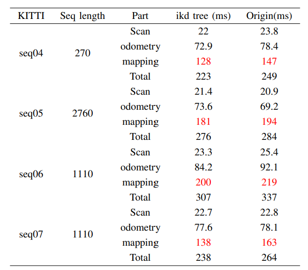

# Introduction

This repository is a fork of YukunXia/VLOAM-CMU-16833, a reimplementation of the VLOAM algorithm [1], for the ROB 530 Mobile Robotics W23. Our fork replaces the FLANN kd trees in the original framework with the ikd tree[2].

The following figure [1] illustrates the pipeline of the VLOAM algorithm. 

# Results

Video: https://youtu.be/NnoxB3r_cDM

# Detailed Usage

Check README.md under `src/vloam_main`
## Prerequisites

OpenCV 4.5.1
Eigen3 3.3
Ceres 2.0
PCL 1.2

This implementation has been verified on Ubuntu 20.04.5 LTS with ROS Noetic
## Evaluation tool

https://github.com/LeoQLi/KITTI_odometry_evaluation_tool

## Data format

Place bag files under "src/vloam_main/bags/"

# Reference:

[1] J. Zhang and S. Singh. Laser-visual-inertial Odometry and
Mapping with High Robustness and Low Drift. Journal of
Field Robotics. vol. 35, no. 8, pp. 1242–1264, 2018.

[2] Y. Cai, W. Xu, and F. Zhang, “ikd-tree: An incremental k-d tree for robotic applications,” 2021
